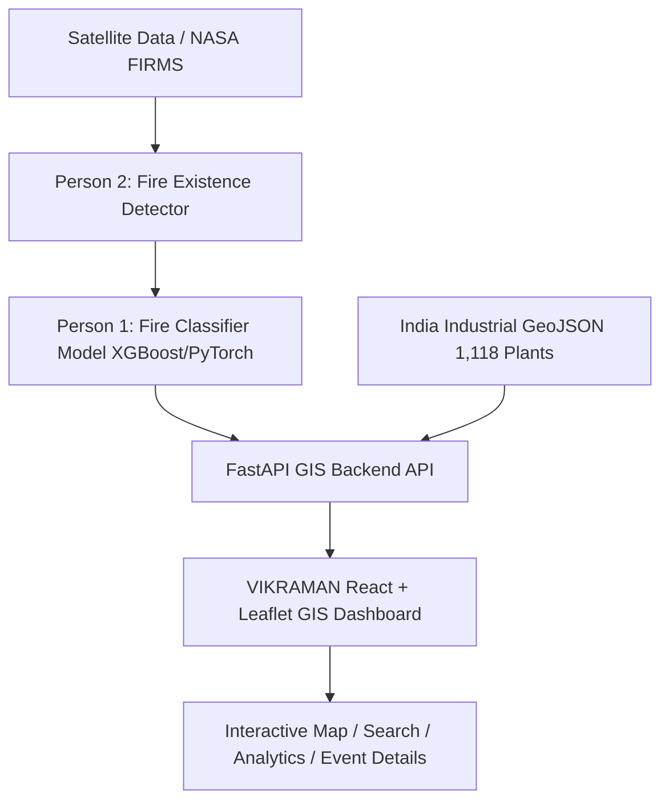

# VIKRAMAN 🛰️🔥
### Satellite-Based Industrial Thermal Anomaly Classification & GIS Visualization System

> **VIKRAMAN** is an advanced GIS operations dashboard and automated backend pipeline designed for satellite-based industrial fire detection, thermal anomaly classification, and proximity intelligence across India.

---

## 🌟 Key Features

- **🛰️ Satellite Thermal Detection Integration**: Automated processing of satellite thermal anomaly points (VIIRS/MODIS) with spatial reference matching.
- **⚡ AI Thermal Classifier Pipeline**: Machine Learning model classifying fire anomalies into `INDUSTRIAL`, `FOREST`, or `OTHER_NATURAL` fires based on land cover, temperature (K), FRP (MW), and GIS contextual data.
- **🗺️ Interactive GIS Web Dashboard**: Modern React + Leaflet web application supporting live data filtering, clustering, and high-resolution basemap switching (OpenStreetMap, Esri Satellite, Topo, Gray Canvas).
- **🏭 Industrial Proximity Engine**: Spatial indexing across 1,118+ major industrial facilities (steel, cement, coal power stations) in India to compute exact proximity distances.
- **🔍 Plant & Location Search Bar**: Centrally integrated search bar with instant autocomplete to quickly jump and zoom to any industrial plant or fire detection site.
- **📊 Real-Time Analytics & KPI Panel**: Instant summary stats for high-severity events, confidence ratings, and fire type distribution.
- **🚀 High-Performance FastAPI Backend**: Fully documented RESTful API with GeoJSON export support (`/api/detections/geojson`, `/api/facilities/geojson`).

---

## 🏗️ System Architecture



---

## 📁 Repository Structure

```text
Backend/
├── backend/                        # FastAPI Backend Application
│   ├── app/
│   │   ├── main.py                 # FastAPI Application Server & CORS Setup
│   │   ├── config.py               # Application Configurations & Settings
│   │   ├── models/                 # Pydantic Schemas & DTOs
│   │   ├── services/               # Fire Detection & Facility Spatial Services
│   │   └── api/                    # REST API Endpoint Routers
│   │       ├── health.py           # Health Check Router
│   │       ├── detections.py       # Detections & GeoJSON Router
│   │       ├── facilities.py       # Industrial Facilities Router
│   │       ├── statistics.py       # Analytics Router
│   │       └── classify.py         # On-demand Classification Router
│   ├── requirements.txt            # Python Dependencies
│   └── tests/                      # Pytest Test Suite
│
├── frontend/                       # React + Vite GIS Web Application
│   ├── src/
│   │   ├── components/             # UI Components
│   │   │   ├── Header.jsx          # Header with Integrated Search Bar & Brand Logo
│   │   │   ├── SearchBar.jsx       # Plant & Location Autocomplete Search Bar
│   │   │   ├── FilterPanel.jsx     # Floating Control Panel & Filters
│   │   │   ├── MapView.jsx         # Interactive Leaflet Map with Basemaps & Markers
│   │   │   ├── EventDetailDrawer.jsx# Slide-out Verification & Details Panel
│   │   │   ├── StatisticsCards.jsx # Live KPI Cards
│   │   │   └── Legend.jsx          # Dynamic Map Legend & Symbols
│   │   ├── hooks/                  # Custom React Hooks (useFireData)
│   │   ├── services/               # Axios API Client Integration
│   │   ├── App.jsx                 # Main Application Layout
│   │   └── main.jsx                # React DOM Mount Entrypoint
│   ├── public/icons/               # Custom Map SVG Icons (fire, forest, industrial)
│   ├── package.json                # Frontend NPM Dependencies
│   └── vite.config.js              # Vite Development & Build Server Config
│
├── gis/                            # GIS Data Layers & GeoJSON Files
│   └── india_industrial_facilities.geojson
│
├── .gitignore                      # Git Exclusion Rules
└── README.md                       # Project Documentation
```

---

## 🚀 Quick Start Guide

### Prerequisites
- **Python**: 3.10 or higher
- **Node.js**: v18.0 or higher
- **NPM**: v9.0 or higher

---

### 1. Backend Setup & Launch

```bash
# Navigate to the backend directory
cd backend

# Create a virtual environment (optional but recommended)
python -m venv venv
# On Windows:
venv\Scripts\activate
# On Linux/macOS:
source venv/bin/activate

# Install dependencies
pip install -r requirements.txt

# Run the FastAPI Uvicorn Server
python -m uvicorn app.main:app --host 0.0.0.0 --port 8000 --reload
```

- **Backend Server**: Runs on `http://localhost:8000`
- **Interactive Swagger API Docs**: Accessible at `http://localhost:8000/docs`
- **ReDoc API Documentation**: Accessible at `http://localhost:8000/redoc`

---

### 2. Frontend Setup & Launch

Open a new terminal window:

```bash
# Navigate to the frontend directory
cd frontend

# Install dependencies
npm install

# Start the Vite development server
npm run dev
```

- **Frontend Web Dashboard**: Open `http://localhost:3000` in your browser.

---

## 🔌 API Endpoints Summary

| Method | Endpoint | Description |
| :--- | :--- | :--- |
| `GET` | `/health` | Health status of backend server |
| `GET` | `/api/detections` | Fetch fire detection events with query filters |
| `GET` | `/api/detections/geojson` | GeoJSON FeatureCollection of fire detections |
| `GET` | `/api/facilities/geojson` | GeoJSON FeatureCollection of 1,118 industrial plants |
| `GET` | `/api/statistics` | Aggregate statistics for total, severity & fire types |
| `POST` | `/api/classify` | On-demand single detection classification API |
| `POST` | `/api/process` | Batch pipeline trigger for new satellite passes |

---

## 🛰️ External Verification Map Integrations

Each event detail drawer includes 1-click external satellite verification links:
- **Google Maps Satellite**: Direct high-zoom satellite imagery coordinates.
- **NASA FIRMS**: MODIS/VIIRS thermal hotspot monitoring system.
- **Google Earth 3D**: High-resolution terrain and 3D industrial perspective.

---

## 🛡️ License

Developed for Smart India Hackathon (SIH) Project.
All rights reserved.
